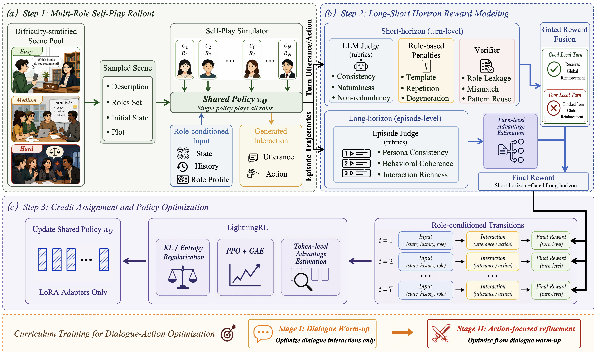

# LSH-RL

LSH-RL is a reproduction codebase for **Long-Short Horizon Reinforcement Learning for
Role-Playing Agents**. It is designed for persona-level role-playing agents that must sustain
character fidelity, natural interaction, and scene progression across multi-turn trajectories.

This repository is a compact fork built on a modified Agent-Lightning training framework. The
modified `agentlightning/` source code is bundled directly in this project, so users do not need
to download Agent-Lightning separately.

## Overview

<p align="center">
  
</p>

Role-playing agents often learn safe stylized responses that appear in character but become
repetitive, low-information, or weakly grounded in the evolving scene. LSH-RL addresses this by
training a shared policy in dynamic multi-character simulation, where each role is conditioned on
its persona, local observation, and scene history.

The method in this repository follows the paper's main training design:

- **Scene-grounded multi-role self-play**: each training example is a structured social scene with
  a scene description, multiple role specifications, initial interactions, and a plot premise.
- **Shared role-conditioned policy**: the same policy generates behavior for different characters,
  while each generation is grounded in that character's profile and local scene observation.
- **Dialogue/action typed transitions**: generated interactions are treated as dialogue or action
  transitions, enabling phase-specific optimization while retaining one shared policy.
- **Short-horizon reward**: turn-level feedback evaluates local character consistency, naturalness,
  non-redundancy, plausibility, and action-dialogue consistency.
- **Long-horizon reward**: character-level trajectory feedback evaluates persona consistency,
  behavioral coherence, and interaction richness across the full scene.
- **Gated reward fusion**: long-horizon credit is only assigned to locally qualified turns, avoiding
  the problem where a globally acceptable trajectory reinforces weak local responses.
- **Dialogue-to-action curriculum**: dialogue RL first stabilizes persona expression; action RL then
  refines scene-grounded behavior from the dialogue checkpoint.

Only the two main reproducible training flows are included. Ablations, unrelated examples, cached
files, checkpoints, logs, and final experiment results are intentionally excluded.

## Repository Layout

```text
LSH-RL/
├── agentlightning/              # Modified Agent-Lightning framework used by LSH-RL
├── assets/                      # Paper figures displayed in this README
├── examples/
│   └── lsh-rl/                  # Main roleplay RL reproduction example
│       ├── configs/             # Dialogue/action training profiles
│       ├── scripts/             # Training entrypoints
│       ├── train_data/          # Low/medium/high roleplay scenes
│       ├── reward_evaluator.py  # Short-term, long-term, and verifier rewards
│       ├── roleplay_agent.py    # Multi-role rollout and trace emission
│       ├── train_stratified.py  # Stratified Agent-Lightning + VERL trainer entrypoint
│       └── plot_training_metrics.py
├── pyproject.toml               # Project and dependency metadata
├── requirements.txt             # Basic pip installation fallback
└── requirements-gpu.txt         # GPU training pip installation fallback
```

Generated artifacts are not bundled. Training creates them under:

```text
examples/lsh-rl/logs/
examples/lsh-rl/checkpoints/
examples/lsh-rl/logs/plots/
examples/lsh-rl/logs/images/
```

## Installation

Use a Linux GPU environment with CUDA-compatible PyTorch, vLLM, and VERL support.

Recommended installation with `uv`:

```bash
cd LSH-RL
uv sync --extra gpu
```

Equivalent pip installation:

```bash
cd LSH-RL
pip install -r requirements-gpu.txt
```

`uv sync --extra gpu` reads this repository's `pyproject.toml`, installs the bundled modified
`agentlightning` package, and adds the GPU training dependencies such as PyTorch, VERL, vLLM,
Transformers, flash-attn, and PEFT.

## Configuration

Replace all `xxx` values with your local model paths and OpenAI-compatible evaluator endpoint.
No private API keys, private URLs, or machine-specific model paths are included.

```bash
export AGL_BASE_MODEL=/path/to/base/model
export AGL_ADAPTER_PATH=/path/to/dialogue_or_dpo_adapter
export ROLEPLAY_ENV_BASE_URL=xxx
export ROLEPLAY_ENV_API_KEY=xxx
export ROLEPLAY_ENV_MODEL=xxx
```

To train dialogue RL directly from the base model, set:

```bash
export AGL_ADAPTER_PATH=""
```

## Run Dialogue RL

The first stage optimizes dialogue transitions with the long-short horizon reward and gated credit
assignment. It produces the dialogue-stage adapter.

```bash
uv run bash examples/lsh-rl/scripts/train_dialogue.sh
```

The dialogue LoRA checkpoint is saved under:

```text
examples/lsh-rl/checkpoints/dialogue-RL/global_step_<N>/actor/lora_adapter
```

## Run Action RL

The second stage initializes from the dialogue checkpoint and focuses on action transitions, using
the same four-GPU runtime shape and `2:1:1` stratified sampling setup.

```bash
export AGL_ACTION_INIT_ADAPTER_PATH=examples/lsh-rl/checkpoints/dialogue-RL/global_step_<N>/actor/lora_adapter
uv run bash examples/lsh-rl/scripts/train_action.sh
```

The action LoRA checkpoint is saved under:

```text
examples/lsh-rl/checkpoints/action-RL/global_step_<N>/actor/lora_adapter
```

## Default Training Setup

- GPUs: `CUDA_VISIBLE_DEVICES=0,1,2,3`
- runners: `AGL_N_RUNNERS=4`
- train batch size: `AGL_TRAIN_BATCH_SIZE=4`
- sampling ratio: low:medium:high = `2:1:1`
- validation: disabled by default with `AGL_TEST_FREQ=0`
- checkpoint interval: `AGL_SAVE_FREQ=4`

The bundled `train_data/` contains 1,000 structured scenes split into low, medium, and high
difficulty tiers. These defaults can be overridden with environment variables before launching
the scripts.

## Logs And Curves

Each run writes a timestamped training log:

```text
examples/lsh-rl/logs/train_<timestamp>.log
```

After training, reward and training curves are generated automatically:

```text
examples/lsh-rl/logs/plots/train_<timestamp>_metrics.csv
examples/lsh-rl/logs/plots/train_<timestamp>_metrics.png
examples/lsh-rl/logs/images/<timestamp>/*.png
```

Regenerate curves manually:

```bash
uv run python examples/lsh-rl/plot_training_metrics.py \
  --log-file examples/lsh-rl/logs/train_<timestamp>.log \
  --out-dir examples/lsh-rl/logs/plots \
  --images-dir examples/lsh-rl/logs/images/<timestamp> \
  --smooth-window 5
```

## Smoke Test

This checks syntax and the stratified sampler without launching GPU training:

```bash
uv run python -m py_compile \
  examples/lsh-rl/train_stratified.py \
  examples/lsh-rl/train_roleplay_agent.py \
  examples/lsh-rl/roleplay_agent.py \
  examples/lsh-rl/reward_evaluator.py \
  examples/lsh-rl/stratified_sampler.py \
  examples/lsh-rl/plot_training_metrics.py

uv run python examples/lsh-rl/stratified_sampler.py
```
